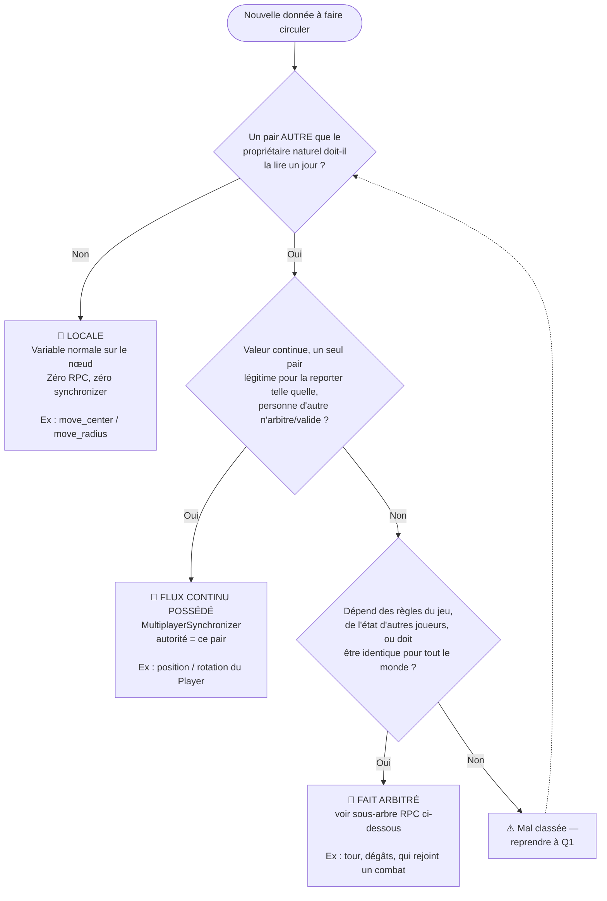
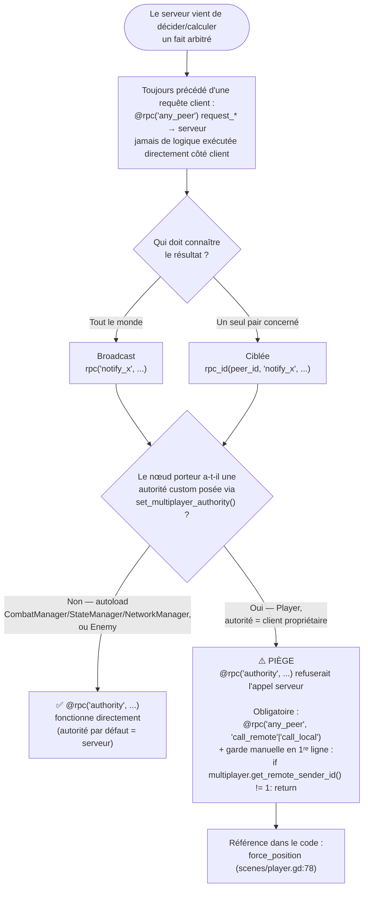

# Réseau — Guide de décision

> Doc de référence, pas un journal (contrairement à `PROGRESS.md`). But : trancher rapidement "quel mécanisme réseau pour cette donnée ?" sans re-dérailler à chaque fois. Née de la session du 2026-09-09, suite au bug `move_center`/`move_radius` (voir exemple travaillé en bas).

## Les 3 familles, en un coup d'œil

| Famille | Qui décide la valeur ? | Qui doit la connaître ? | Mécanisme |
|---|---|---|---|
| **Locale** | Un seul pair, personne d'autre ne s'en soucie | Personne d'autre | Variable normale, **aucun réseau** |
| **Flux continu possédé** | Un seul pair, en continu, sans contestation possible | Tout le monde, en continu | `MultiplayerSynchronizer` (autorité = ce pair) |
| **Fait/événement arbitré** | Le serveur (règle du jeu, dépend de plusieurs joueurs, ou décision ponctuelle) | Un ou plusieurs pairs, au moment où ça change | RPC (`request_*` → serveur, `notify_*` → pairs concernés) |

La confusion qui coûte cher : traiter une donnée de la 1ʳᵉ famille comme si elle était de la 3ᵉ (cf. exemple en bas). Le réflexe "ça touche au combat donc ça doit passer par `CombatManager`/le serveur" est un faux ami.

## Arbre de décision

## Sous-arbre — une fois qu'on sait que c'est un fait arbitré (RPC)

Le nœud `H` (piège) est celui sur lequel on est déjà tombés deux fois (`force_position`, et failli retomber dessus pour `move_center`) — c'est le point du diagramme à vérifier en premier réflexe avant d'écrire un `@rpc` sur autre chose qu'un autoload.

## Référence — tous les mécanismes actuellement dans Synterra

| Mécanisme | Fichier / fonction | Sens | Rôle |
|---|---|---|---|
| Synchronizer, autorité client | `player.tscn` (position/rotation) | Client → tous | Position/rotation, jamais validées serveur (décision actée, jeu coop) |
| Locale (aucun réseau) | `combatant.gd` — `move_center`/`move_radius` | — | Contrainte de déplacement en combat, propre à chaque joueur (à corriger : actuellement mutée par erreur côté serveur) |
| RPC `any_peer` → serveur | `network_manager.gd:89` `update_player_info` | Client → serveur | Connexion + mot de passe |
| RPC `any_peer("call_local")` → serveur | `combat_manager.gd:71` `request_action` | Client → serveur | Join/Ready/EndTurn/Attack (le `call_local` impose la garde `is_server()` en 1ʳᵉ ligne) |
| RPC `any_peer` → serveur | `state_manager.gd:13` `request_state_change` | Client → serveur | ⚠️ Plus appelée nulle part (obsolète depuis que `CombatManager` déclenche directement les transitions d'état) |
| RPC `authority("call_remote")`, broadcast | `network_manager.gd:103` `update_players` | Serveur → tous | Liste des joueurs |
| RPC `authority("call_remote")`, ciblée | `network_manager.gd:109` `notify_connection_error` | Serveur → 1 client | Erreur de connexion |
| RPC `authority("call_local")`, broadcast | `state_manager.gd:18` `notify_state_changed` | Serveur → tous (+ ciblée via `rpc_id` pour le rattrapage) | Changement d'état joueur/combat |
| RPC `authority("call_local")`, broadcast | `combat_manager.gd:54` `notify_turn_changed` | Serveur → tous | Changement de tour |
| RPC `authority("call_local")`, broadcast | `combat_manager.gd:64` `notify_health_changed` | Serveur → tous | PV mis à jour |
| RPC `any_peer("call_local")`, ciblée + garde manuelle | `scenes/player.gd:78` `force_position` | Serveur → 1 client | Téléportation à la jonction d'un combat (cas "nœud à autorité client", voir piège ci-dessus) |

## Exemple travaillé — pourquoi ce doc existe

`move_center`/`move_radius` (contrainte de déplacement pendant un tour de combat) a été codée comme si c'était un fait arbitré : mutée côté serveur dans `combat_manager.gd::request_action` (`combatant.set_available_move()`), sans RPC pour la redescendre au client. Or elle coche "Famille Locale" à la Q1 : personne d'autre que le joueur concerné ne la lit, et elle n'est de toute façon jamais validée serveur (cohérent avec la décision "pas d'anti-triche sur le mouvement"). Résultat du mauvais classement : le serveur modifiait sa propre copie du nœud, jamais celle du client qui exécute réellement le clamp — le joueur récupérait l'usage du cercle de déplacement du début de tour après avoir attaqué.

Fix : sortir l'appel de `combat_manager.gd`, l'appeler directement côté client (`ui/game_ui.gd::_on_attack_button_button_up`) au moment du clic. Zéro RPC nécessaire — la donnée n'aurait jamais dû sortir du client.
